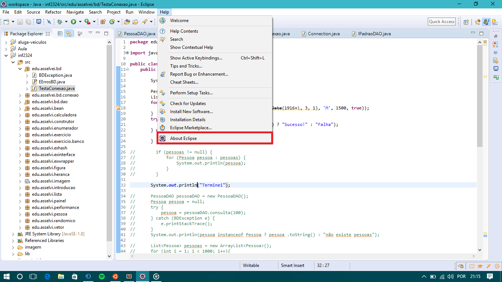
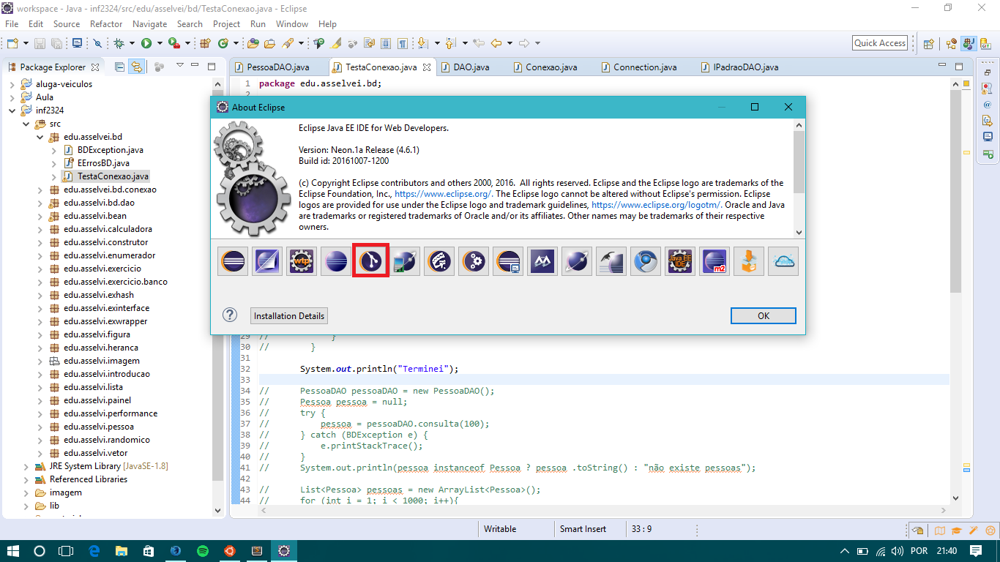
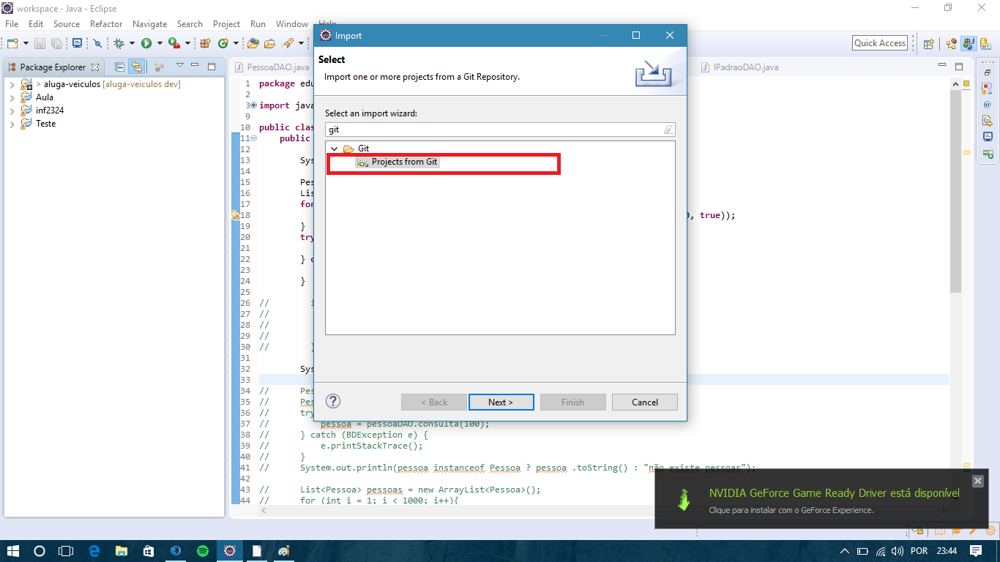

#Projeto aluga-veiculos

##Verificar instalação do git
Primeiramente verifique se no seu Eclipse tem instalado o git. Para verificar, é só fazer como nas imagens abaixo.

> verificar se tem o ícone do EGit.

##Clonar o repositório
* Clicar no botão _Clone or download_ acima.
* Copiar a url que será exibida

##Importando para o eclipse
Dê um botão direito nos projetos e clique em **importar**.
